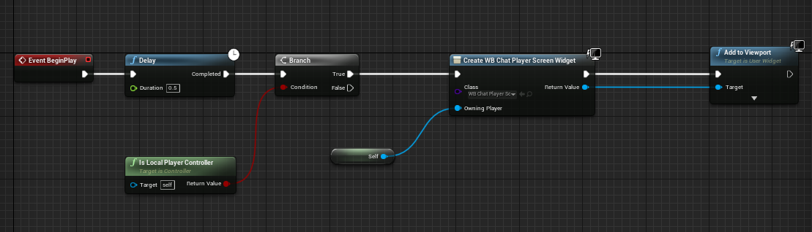
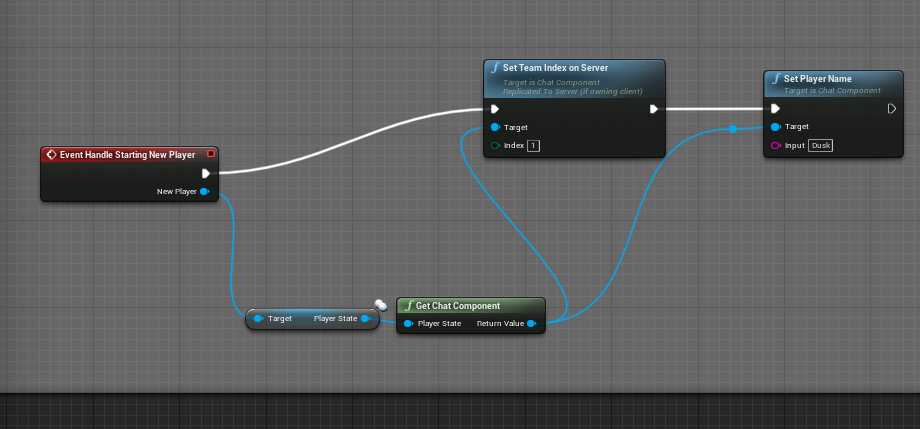

# Chat Component
Chat Component is a class that handles replication and data for the chat system.

## Initial Setup
- Add Chat component to the Player Controller.

- Add the chat widget to any widget and add it to the screen once the chat component is initialized (e.g., in the Begin Play of the player controller with a delay of 0.2).

## Initializing Player Data
You have to set the player name and team when players are spawned, and their data is loaded.
The Chat Component tries to get the player name from the player state by default.
To know the best way to get this data, please refer to the networking system documents used by your project (e.g., Nakama, EOS, etc.).
Here is an example of setting data in the Handle Starting New Player event in the default game mode:

## Ready to Use
Now the chat component is fully set up, and you can press Enter to begin the chat or use Shift+Enter to use All chat.

# Technical Info and Customization
By default, you should not worry about these functions and properties; the chat system will take care of most use cases.
This information is only for users interested in customizing or understanding this system better.

## Chat Component Functions and Properties:

| Name                        | Type               | Description                                                                                                          |
| :------------------------   | :-----------------:| :-----------------------------------------------------------------------------------------------------------------   |
| ChatOpenKey                 | Variable           | Key to be used to open chat and send messages (For touch, you can call the Press and AllChatPress functions in the chat widget).   |
| AllChatOpenKey              | Variable           | Key to open all chat (by default, it's Shift+Enter).                                                                |
| MustHoldShiftForAllChatKey  | Variable           | Should all chat key require Shift to be held down.                                                                 |
| RejectMessagesWithNoPlayerName | Variable        | Reject messages if the name of the player is none or empty.                                                        |
| AllowClientToChangeName     | Variable           | Allow the client to change name on the server (by default, it's disabled).                                          |
| SetTeamIndexOnServer        | Function           | Set the team index of the player for this component.                                                                |
| SendString                  | Function           | Send a message to others.                                                                                            |
| SetPlayerName               | Function           | Set Player Name (by default called by the authority server).                                                        |
| MakeServerAnnouncement      | Function           | Make an announcement to all players.                                                                                 |
| MakeServerAnnouncementToPlayer | Function         | Make an announcement to a specific player.                                                                          |
| MakeServerAnnouncementToTeam | Function           | Make an announcement to a specific team.                                                                            |
| MutePlayer                  | Function           | Mute a certain player (Local function. Muted player messages will be ignored, but they can message others).         |
| UnMutePlayer                | Function           | UnMute a certain player.                                                                                           |
| GetMutedPlayers             | Function           | Get a list of muted players.                                                                                       |
| SetMuteEnemies              | Function           | Mute everyone who has a different team index (except server announcements, which is 255).                         |
| BanPlayerFromChatting       | Function           | Bans a player from chatting (Authority function. The player will receive an error when attempting to chat).         |
| UnBanPlayerFromChatting     | Function           | UnBans a player from chatting.                                                                                     |
| GetBannedPlayers            | Function           | Returns a list of players banned from chatting.                                                                    |
| BanMessage                  | Variable           | Error to show when a banned player attempts to chat.                                                               |
| ServerMessageSenderName     | Variable           | Server message's name prefix to show when the server sends an announcement (By default empty).                     |

## Chat Widget Properties:

| Name                     | Type                | Description                                                                                                    |
| :----------------------- | :------------------: | :-----------------------------------------------------------------------------------------------------------   |
| HintText                 | Variable            | Grayed out hint text to show when the player is not focusing on the chat.                                       |
| InitialMessageText       | Variable            | A welcome text in the form of a server announcement.                                                            |
| ShowTimeStamp            | Variable            | Whether to show time for messages or not.                                                                       |
| ShowHour                 | Variable            | Include the hour of the message received time.                                                                  |
| UseTimeOfTheDay          | Variable            | Use time of the day instead of game time.                                                                       |
| FadeSpeed                | Variable            | Inactivate time when chat starts to fade.                                                                       |
| ShouldFade               | Variable            | Should the chat ever fade.                                                                                     |
| ApplyStyleToPlayerMessage | Variable           | Apply the rich text

 block style to the whole message instead of just the player name.                          |
| Press                    | Function            | Press function, which is by default called using inputs defined in the chat component, useful for opening chat in any other way.    |
| AllChatHandle            | Function            | AllChatHandle function, which is by default called using inputs defined in the chat component, useful for opening all chat in any other way. |

## Customizing Chat Color And Font
The chat component uses [UMGRichTextBlock](https://docs.unrealengine.com/4.27/en-US/InteractiveExperiences/UMG/UserGuide/UMGRichTextBlock/) styling to apply styles to texts.
You can apply your own style by copying the ChatStyle asset to your project and set it to your own version in ChatMessageWidget (Recommended) or edit the ChatStyle asset directly.