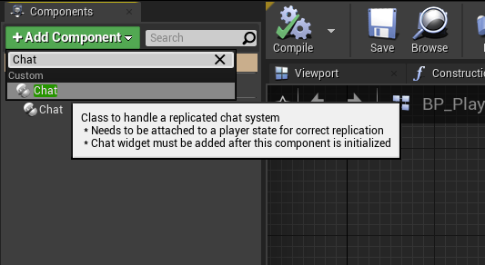

# Chat Component is a class that handles replication and data for chat system
  
## Initial Setup
- Add chat component to player state  

  
  
- Add chat widget to any widget and add it to screen once chat component is initialzed (For example in begin play of player controller with a delay of 0.2)  

  
  

## Initializing player data
 You have to set the player name and team when players are spawned and their data is loaded.  
 The Chat Component tries to get player name from player state by default.  
In order to know best way to get these data please refer to networking system documents that is used by your project (nakama , EOS ,etc...)  
Here is an example of setting data in Handle Starting New Player event in default game mode :  
  
  
## Ready to use 
Now chat component is fully setup and you can press Enter to begin the chat or use Shift+Enter to use All chat 

# Technical info and Customization 
By default you should not worry about these functions and properties, chat system will take care of most use cases.  
This is only for users who are intrested in customizing or understanding this system better.  
  
## Chat Component functions and properties :  

| Name   | Type   | Description   |
| :---   |    :----:   |    :----:     |
| ChatOpenKey | Variable    | Key to be used to open chat and send messages (For touch you can call the Press and AllChatPress functions in chat widget)   |
| AllChatOpenKey   | Variable   | Key to open all chat ( by default its shift+enter ) |
| MustHoldShiftForAllChatKey   | Variable   | Should all chat key require shift to be held down  |
| RejectMessagesWithNoPlayerName   | Variable   | Reject messages if name of player is none or empty |
| AllowClientToChangeName   | Variable   | Allow client to change name on server (by default its disabled) |
| SetTeamIndexOnServer   | Function   | Set team index of player for this component |
| SendString   | Function   | Send message to others |
| SetPlayerName   | Function   | Set Player Name (by default called by authority server)     |
| MakeServerAnnouncement   | Function   | Make anouncement to all players     |
| MakeServerAnnouncementToPlayer   | Function   | Make anouncement to specific  Player     |
| MakeServerAnnouncementToTeam   | Function   | Make anouncement to specific  Team     |
| MutePlayer   | Function   | Mute a certain player (Local function. muted player messages will be ignored but they can message others)     |
| UnMutePlayer   | Function   | UnMute a certain player|
| GetMutedPlayers   | Function   | Get  a list of muted players|
| SetMuteEnemies   | Function   | Mute everyone who has a diffrent team index (except server anouncements which is 255 ) |
| BanPlayerFromChatting   | Function   | Bans a player from chatting (Authority function. player will receive an error when attempting to chat) |
| UnBanPlayerFromChatting   | Function   | UnBans a player from chatting |
| GetBannedPlayers   | Function   | Returns list of players banned from chatting |
| BanMessage   | Variable   | Error to show when a banned player attempts to chat |
| ServerMessageSenderName   | Variable   | Server messages name prefix to show when server sends a anouncement  (By default empty) |  

## Chat widget properties  

| Name   | Type   | Description   |
| :---   |    :----:   |    :----:     |
| HintText   | Variable   | Grayed out hint text to show when player is not focusing the chat |
| InitialMessageText   | Variable   | A welcome text in form of server anouncement  |
| ShowTimeStamp   | Variable   | Whether to Show time for messages or not   |
| ShowHour   | Variable   | Include hour of message received time |
| UseTimeOfTheDay   | Variable   | Use time of the day instead of game time  |
| FadeSpeed   | Variable   | Inactivate time when chat starts to fade  |
| ShouldFade   | Variable   | Should Chat ever fade |
| ApplyStyleToPlayerMessage   | Variable | Apply the rich text block style to whole message instead of just player name |
| Press   | Function   | Press function which is by default called using inputs defined in chat component useful for opening chat any other way |
| AllChatHandle   | Function   | AllChatHandle function which is by default called using inputs defined in chat component useful for opening chat any other way |

 
## Customizing Chat Color And Font  
Chat component uses [UMGRichTextBlock](https://docs.unrealengine.com/4.27/en-US/InteractiveExperiences/UMG/UserGuide/UMGRichTextBlock/) syling to apply styles to texts.  
You can apply your own style by copying ChatStyle asset to you project and set it to your own version in ChatMessageWidget (Recomended) or edit the ChatStyle asset directly.