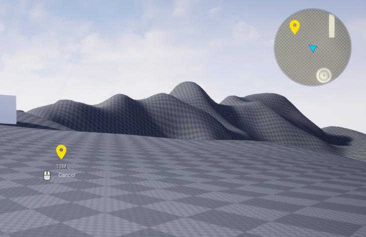

# Ping system is a tool that can spawn networked pings using the chat component 
    
# Initial Setup
- Add Chat component to Player Controller  

  
  
- Call one of these functions

  
  

# Setting up a ping
Examples are placed in Plugins/TitanUMG/Content/UMG/PingSystem/LocationPing  
You can create a Ping by making a child bp of PingActor class.
PingActor by default inherits a sphere collision and a TitanWidgetComponent. You've to set the widget class on Widget component (this widget component remains on screen even the actor is outside of current camera view )  

However you can attach any kind of visual representation to this ping actor.

# Destroy handling
Ping actor has a event called Ping Begin Destroy which will be called before ping is destroyed.
Then function Is Ping Ready To Destroy is called which you can override to handle any kind of visual effect before destroying the ping.

# Map System Compatibilty 
You can attach a MapPOI component to any ping (which is recommended) To also draw the pings on the map.
  
# Properties 

| Name   | Type   | Description   |
| :---   |    :----:   |    :----:     |
| IsGlobalPing | Bool    | Should this ping spawn for eveyone regardless of team |
| LifeTime | float    | LifeTime of the ping. if less than zero then its manually handled by you |
| MaxNumberOfPings | int    | Max number of this ping (will remove older ones if more is spawned) |

# Properties in Chat Component
| Name   | Type   | Description   |
| :---   |    :----:   |    :----:     |
| MinTimeBetweenPings | float    | Anti spam feature |
| MutePlayerPings | Function    | Anti spam feature (Local only) |
| UnMutePlayerPings | Function    | Anti spam feature (Local only)|
| BanPlayerFromChatAndPing | Function    | Anti spam feature (Authority)|
| UnBanPlayerFromChatAndPing | Function    | Anti spam feature (Authority)|