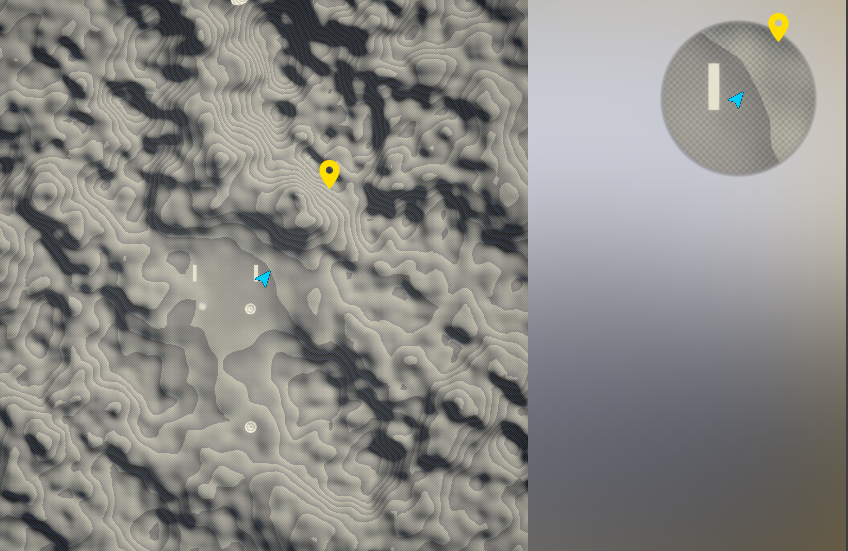

# Map System is a used to capture maps and display them on screen. It handles player position, Zoom and Points of intrests .
(Examples are in plugin content in chat level)

# How to use
You can drop a map volume actor to your level. Set or create a render target and assign it to map volume capture target (you have to size your render target based on your needs).  
Then open your render target and move around and play with ortho width variable until you capture the desired map image.
Once capturing is done you can right click render target and create an image texture (or you can use the render target directly as map image however its not recommended for most games.)
You can also customize and stylize your map by adding post process material to map capture.  
Once the static image is generated you can export it to your favorite image editor to draw and customize on top of it or use it as is.

## Add Widget
Make a widget and add map widget to it . You need to set the map texture and also set the reference to map volume in level for this map if you've more than one map volume in this level(map volume is used for automatic position calculations ).

