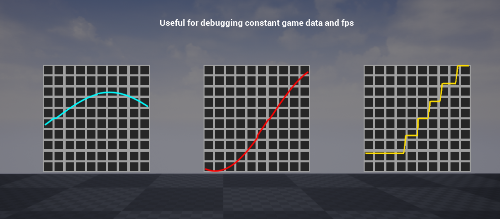

# Graph
Graph is an image widget which can draw an array of lines on top of the background useful for tracking and debugging constant data and looking for irregular spikes.
` Examples are in WB_Graphs widget in plugin content`

## How to use
- Add graph widget to your widget.
- Use add point in the end and provide data in range of -1 and 1

## Properties 

| Name             | Type          | Description                                                    |
| :--------------- | :-----------: | :------------------------------------------------------------  |
| ConsistentLine   | bool          | Determines whether the line should be consistent from left to right without any cuts regardless of the data. |
| GraphScrollSpeed | float         | Automatic scrolling speed for each frame.                     |
| LinearColor      | FLinearColor  | Color of the line.                                             |
| LineSize         | float         | Size of the line.                                              |
| AddPoint         | Function      | Adds a point to the graph where X is time and Y is location (Ranges from -1 to 1). |
| AddPointInTheEnd | Function      | Adds a point at X = 1 and Y (Y is specified as a parameter).   |
| ManualScroll     | Function      | Manually scrolls the graph across the X axis by a specified amount. |