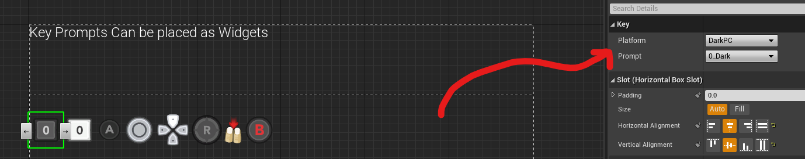
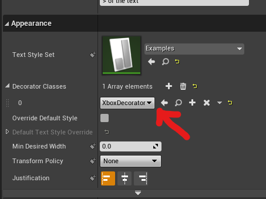
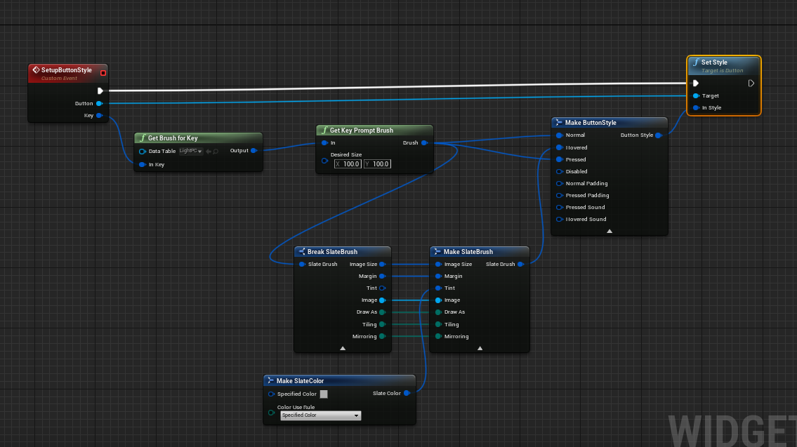
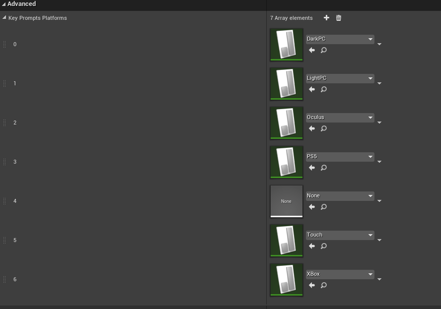

# Key prompts system can show a premade icon for a key . Just drag and drop and select the key that you need.

`Examples in KeyPromptScreen and WB_ActionMapping widget `

## There are Two ways that you can use keyprompts

### - Use keyprompt widget:

Add a keyprompt widget then select platform and key from details panel.

### - Use as rich text block image in between text:

Add your desired platfor decorator to a rich text block

Enter your image ID in between text in desired place like this: `</>`

`You can lookup desired image id in data tables located in TitanUMG\Content\KeyPrompts\KeyboardAndMouse`

### Get Brush from key

You can get brush for a key

# Adding custom key prompts:

You can add your own key prompts to the sytem. Create a data table with row structure of TitanRichImageRow, Populate it and add it to array located in TitanUMG project settings

# Extra Platforms

You can get the icons for extra platforms for TitanUMG [here](./ExtraPlatforms.zip) and for KeyPromptsIcon Plugin [here](./KeyPromptsIconsFull.zip) If you have the lisence to use the icons .
Paste the folder on top of existing folder and add the data tables to array in project settings!
