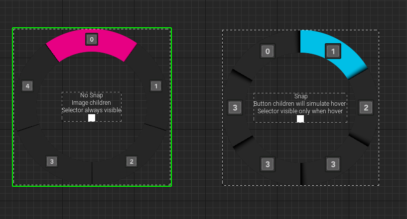
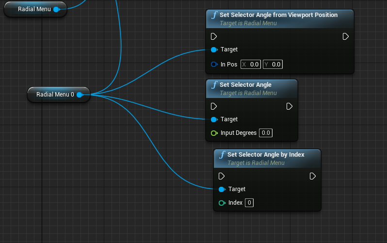
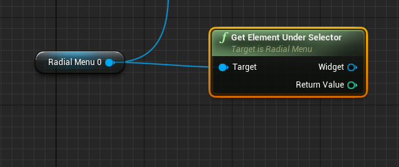

# Radial Menu Widget
This Radial Menu dynamically accepts children without the need for building static textures.

Examples are placed in WB_RadialMenu, PingSpawner, and WB_Mobile in the plugin content.

## How To Use
- Drag the Radial Menu to your widget.
- Add children by dragging and dropping them into the menu. Buttons can also be added if you want to simulate hovering effects (buttons will be cosmetic only).
- Pass input to the Radial Menu using one of these functions:

- Get the output using this function (returns the selected index and widget):

## Variables and Functions

| Name                     | Type                 | Description                                                                                                  |
| :----------------------- | :-------------------:| :----------------------------------------------------------------------------------------------------------  |
| RadialMenuBaseMaterial   | UMaterialInterface*  | The material used for the Radial Menu base.                                                                 |
| SelectorColor            | FLinearColor         | Foreground color used for the selector.                                                                      |
| BackgroundColor          | FLinearColor         | Background color used for the Radial Menu.                                                                   |
| DividerOpacity           | float                | Opacity of the divider between each element.                                                                 |
| OptionsPadding           | float                | Padding for options relative to the widget size.                                                             |
| BackgroundPadding        | float                | Background padding relative to the widget size.                                                              |
| SnapSelector             | bool                 | Determines if the selector should snap instead of transitioning smoothly.                                   |
| HideSelectorWhenNotHovered | bool                | Determines if the selector should be visible only when hovered with the mouse.                             |
| BackgroundRotationOffset | float                | Rotation offset for the background (0-90 degrees, starting from top and clockwise). Default value is 0.0.    |
| SetSelectorColor         | Function             | Setter function to set the selector color.                                                                   |
| SetSelectorAngle         | Function             | Setter function to set the angle of the selector (0-360 degrees, starting from top and clockwise).          |
| SetSelectorAngleByIndex  | Function             | Setter function to set the selector angle based on an item index.                                           |
| SetSelectorAngleFromViewportPosition | Function | Setter function to calculate the angle from viewport position.                                            |
| GetElementUnderSelector  | Function, BlueprintPure | Getter function to get the element under the selector.                                                   |
| SetSelectorVisibility    | Function             | Setter function to set the visibility of the selector.                                                     |
| MouseDown                | Event                | Event delegate triggered when a mouse button is pressed down.                                              |
| MouseMove                | Event                | Event delegate triggered when the mouse is moved.                                                           |
| MouseUp                  | Event                | Event delegate triggered when a mouse button is released.                                                   |
| TouchStart               | Event                | Event delegate triggered when a touch event starts.                                                         |
| TouchMove                | Event                | Event delegate triggered when a touch event is moved.                                                       |
| TouchEnd                 | Event                | Event delegate triggered when a touch event ends.                                                           |