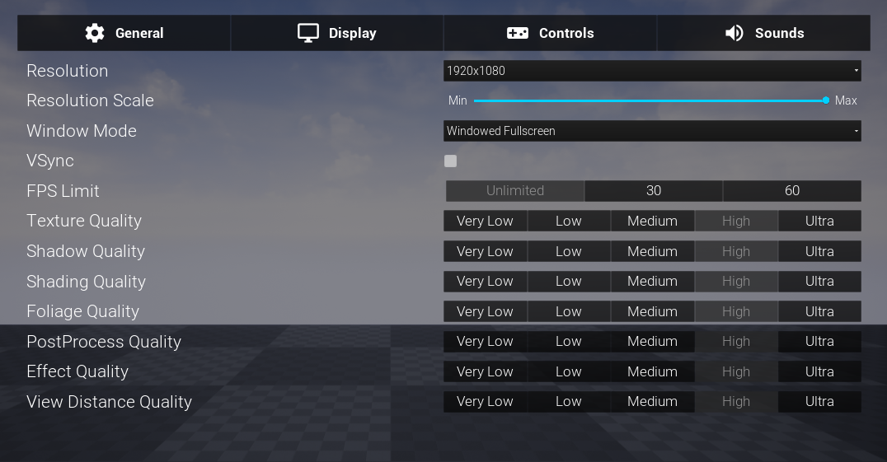

# Settings
You can use this widget to be used in development ( so you can focus on other important aspects) And also you can build your own settings on top of this 
This text can be replaced in WB_General in settings widget of this plugin content folder
` Settings widget is experimental`

## Notes:
 - Apply sound settings in begining of gameplay.
 - Other settings are child of game user settings which are applied by unreal engine.
 - Resolution settings are not recommended for non PC platforms and are disabled by default. however resolution scale is a good option for mobile devices to reduce load.
 - Add you gameplay related Settings General tab.
 