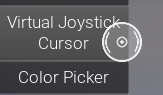
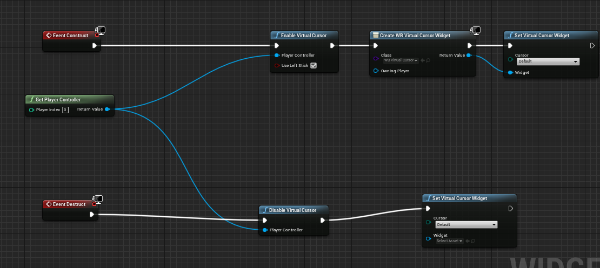

# Virtual Cursor
A cursor for gamepads which is controlled by joystick.  

## How to use

You can customize the behaviour in project settings .
You can also use a different cursor widget than what we provide or customize this yourself.