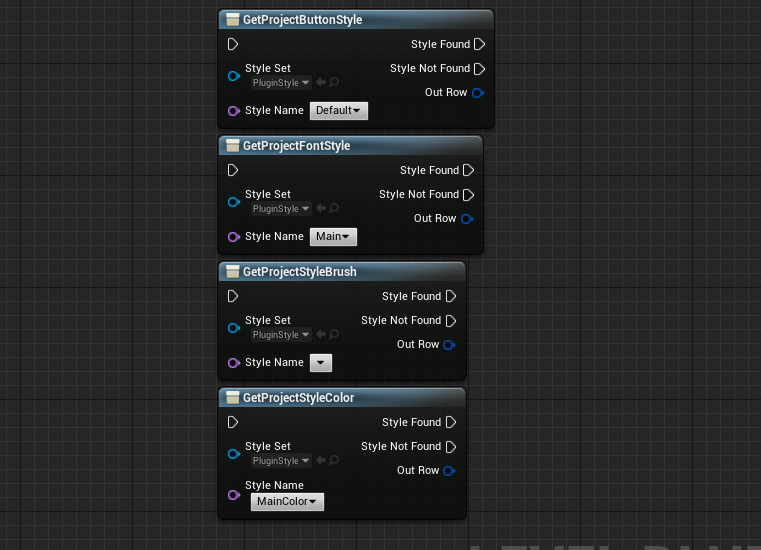
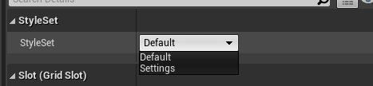

# Style System
Pre define your brushes fonts etc... and get them and apply them easily whenever needed.  
This way you can update whole style of your project using a click,  
You can ensure that there is unity in project design and also speed up your work.

## How to use
- You can define the default project style set in project settings
- You can get predefined styles using:

## Titan Button

Titan button will get a list of styles from project styles which you can select from a drop down.
