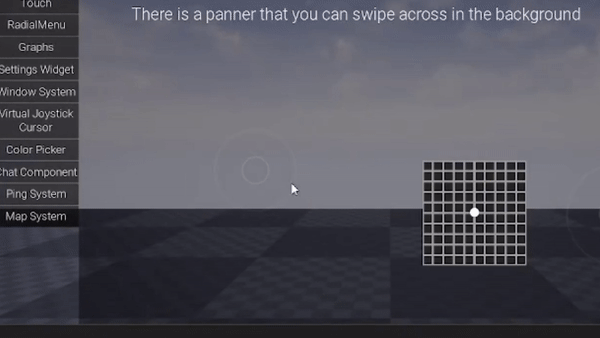

# This plugin handles touch using three components 

## Titan Panner minimal
Handles panning and swiping inputs. 

## Titan Panner 
Same as Titan Panner minimal but handles pinch and pinch angle. Can draw text as well.

## Titan Joystick
A UMG animatable joystick. Can be 2D or 1D.

# Titan Panner Minimal

| Name                     | Type                  | Description                                                                                                      |
| :----------------------- | :--------------------: | :--------------------------------------------------------------------------------------------------------------  |
| VisualSize               | FVector2D             | The size of the control (if <= 1.0, it's relative to the Borders, > 1.0 is absolute).                           |
| BackGround               | UTexture2D*           | For sticks, this is the background image to be displayed. Can be empty for panners.                             |
| InputScale               | FVector2D             | The scale for control input.                                                                                     |
| MainInputKey             | FKey                  | The main input to send from this control (for sticks, this is the horizontal axis).                              |
| AltInputKey              | FKey                  | The alternate input to send from this control (for sticks, this is the vertical axis).                           |
| PressInputKey            | FKey                  | The input key to send from this control when pressed (for sticks, this is the vertical axis).                    |
| ActiveColor              | FLinearColor          | The color of all controls while any control is active.                                                           |
| DeActiveColor            | FLinearColor          | The color of all controls while no controls are active.                                                          |
| AllowMouse               | bool                  | Determines if mouse interaction is allowed.                                                                      |
| VisualCenter             | FVector2D             | The center of the visual control. Default value is (0.5, 0.5).                                                   |
| bIsDisabled              | bool                  | Set to `true` to manually disable the control. It will fire an event if the player tries to activate it. **Warning**: Do not disable when the joystick is touched.|
| OnClickedWhenDisabled    | FOnClickedWhenDisabled| Called when the button is clicked when disabled.                                                                 |
| DoubleClickInputKey      | FKey                  | The input key to recognize a double-click event.                                                                 |
| DoubleClickMaxTime       | float                 | The maximum time allowed between the first touch and the second touch to register as a double-click event. Default value is 0.2 seconds.|
| DoubleClickMaxDistance   | float                 | The maximum distance between the first touch and the double-click touch to register as a double-click event. Default value is 100.0.|
| OnPressChange            | Event                 | Event that gets triggered when the joystick's press state changes.                                               |
| OnOutputChange           | Event                 | Event that gets triggered when the joystick's output value changes.                                              |

# Titan Panner
Titan panner inherits all properties from panner minimal plus these

| Name                     | Type                  | Description                                                                                                      |
| :----------------------- | :--------------------: | :--------------------------------------------------------------------------------------------------------------  |
| PinchInputKey            | FKey                  | The alternate input to send from this control (for sticks, this is the vertical axis).                         |
| PinchRotateInputKey      | FKey                  | The alternate input to send from this control for pinch rotation gesture (e.g., on touchpads or touch screens).  |
| BackGroundDrawEffect     | uint8                 | Slider does not work as expected. Choose an effect from the available 7 effects to draw the background.         |
| TextDrawEffect           | uint8                 | Slider does not work as expected. Choose an effect from the available 7 effects to draw the text.               |
| FontInfo                 | FSlateFontInfo        | Contains information about the font used for displaying text.                                                   |
| FontCenterCorrection     | FVector2D             | The correction vector to adjust the center of the font.                                                         |
| TextToShow               | FString               | The text to display on the widget. Set to NULL to disable displaying text.                                       |
| TextColor                | FLinearColor          | The color of the displayed text.                                                                                |
| Pinch                    | Event | Event that gets triggered when the pinch gesture value changes.                                                |
| PinchAngle               | Event | Event that gets triggered when the pinch rotation angle changes.                                               |

# Titan Joystick

| Name                | Type          | Description                                                                                                             |
| :------------------ | :-----------: | :---------------------------------------------------------------------------------------------------------------------  |
| Thumb               | UTexture2D*   | For sticks, this is the Thumb image to be displayed.                                                                    |
| Center              | FVector2D     | The center point of the control (if <= 1.0, it's relative to the screen, > 1.0 is absolute).                          |
| ThumbSize           | FVector2D     | For sticks, the size of the thumb (if <= 1.0, it's relative to the screen, > 1.0 is absolute).                          |
| InteractionSize     | FVector2D     | The interactive size of the control (if <= 1.0, it's relative to the screen, > 1.0 is absolute).                        |
| RecenterSize        | float         | Range: 0-1. Recenter if touch is inside this box (Interaction size * RecenterSize). Prevents the center from going near widget ends.|
| TimeUntilDeactive   | float         | How long after user interaction will all controls fade out to Inactive Opacity.                                         |
| TimeUntilReset      | float         | How long after going inactive will controls reset/recenter themselves (0.0 will disable this feature).                  |
| ActivationDelay     | float         | How long after joystick enabled for touch (0.0 will disable this feature).                                              |
| bPreventRecenter    | bool          | Whether to prevent joystick re-center.                                                                                  |
| StartupDelay        | float         | Delay at startup before the virtual joystick is drawn.                                                                  |
| ThumbDrawEffect     | uint8         | Slate Draw effect. Choose an effect from the available 7 effects to draw the thumb.                      |

# Tips

### How to make recenterable joystick

- Drag Joystick to a widget
- Size it to area that you want recenter to happen
- Reduce the thumb and background image size (You can set it to less than 1 so size will be relative or you can set it as an absolute size )  
- Set recenter size to 1 ( you can try other sizes to limit the joystick from moving too much to corners)