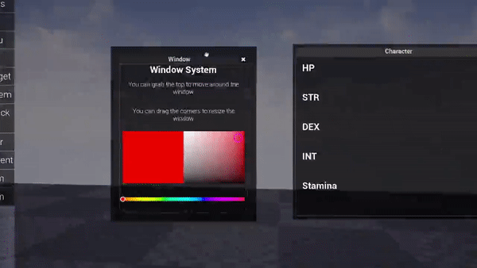

# Window System
Resizable and draggable window system for pc and touch

## How To Use

- Drag Titan Window into a `Canvas Panel `.
- Drag the content to the window.

# Properties

| Name                                  | Type               | Description                                                    |
| :------------------------------------ | :---------------:  | :------------------------------------------------------------  |
| WindowText                            | FText              | Text to display in the window border.                          |
| WindowFont                            | FSlateFontInfo     | Font information for the window text.                          |
| BorderBackground                      | FSlateBrush        | Brush to drag as the background of the border.                 |
| BackGroundBorderPadding               | FMargin            | Padding for the background border.                             |
| BackGroundBorderColor                 | FSlateColor        | Animatable color for the background border.                    |
| BackGroundBorderColorHovered          | FSlateColor        | Animatable color for the background border when hovered.       |
| TopBorder                             | FSlateBrush        | Brush to drag as the top border.                               |
| TopBorderColor                       | FSlateColor        | Animatable color for the top border.                           |
| TopBorderColorHovered                | FSlateColor        | Animatable color for the top border when hovered.              |
| QuitButton                            | FSlateBrush        | Image for the quit button.                                     |
| QuitButtonStyle                       | FButtonStyle       | Style for the quit button.                                     |
| ShowQuitButton                        | bool               | Determines whether to show the quit button or not.            |
| CornerDetectionTolerance              | float              | Tolerance for corner detection during resizing.                |
| MinimumSize                           | FVector2D          | Minimum size for the resizable widget.                         |
| MaxSize                               | FVector2D          | Maximum size for the resizable widget.                         |
| LimitToCanvasBounds                   | bool               | Determines whether to limit the position to the canvas bounds. |